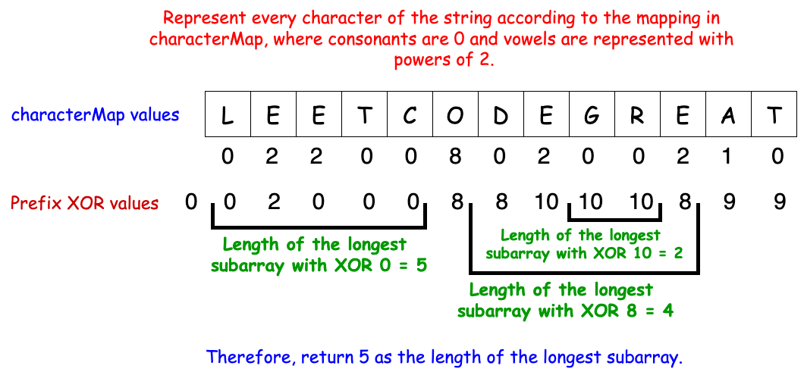

<h2><a href="https://leetcode.com/problems/find-the-longest-substring-containing-vowels-in-even-counts">1473. Find the Longest Substring Containing Vowels in Even Counts</a></h2><h3>Medium</h3>

Given the string <code>s</code>, return the size of the longest substring containing each vowel an even number of times. That is, &#39;a&#39;, &#39;e&#39;, &#39;i&#39;, &#39;o&#39;, and &#39;u&#39; must appear an even number of times.

&nbsp;

<strong class="example">Example 1:</strong>

<pre>
<strong>Input:</strong> s = &quot;eleetminicoworoep&quot;
<strong>Output:</strong> 13
<strong>Explanation: </strong>The longest substring is &quot;leetminicowor&quot; which contains two each of the vowels: <strong>e</strong>, <strong>i</strong> and <strong>o</strong> and zero of the vowels: <strong>a</strong> and <strong>u</strong>.
</pre>

<strong class="example">Example 2:</strong>

<pre>
<strong>Input:</strong> s = &quot;leetcodeisgreat&quot;
<strong>Output:</strong> 5
<strong>Explanation:</strong> The longest substring is &quot;leetc&quot; which contains two e&#39;s.
</pre>

<strong class="example">Example 3:</strong>

<pre>
<strong>Input:</strong> s = &quot;bcbcbc&quot;
<strong>Output:</strong> 6
<strong>Explanation:</strong> In this case, the given string &quot;bcbcbc&quot; is the longest because all vowels: <strong>a</strong>, <strong>e</strong>, <strong>i</strong>, <strong>o</strong> and <strong>u</strong> appear zero times.
</pre>

&nbsp;

<strong>Constraints:</strong>

<ul>
	<li><code>1 &lt;= s.length &lt;= 5 x 10^5</code></li>
	<li><code>s</code>&nbsp;contains only lowercase English letters.</li>
</ul>

<h3>Note</h3>

<h4>해결 과정</h4>

<ul>
<li>실패...</li>
</ul> 

<h4>문제점</h4>
<ul>
<li>다음에 나왔을 때 풀 수 있을까..??</li>
</ul>

<h4>개선할 점</h4>
<ul>
</ul>

<h4>알게 된 점</h4>
<ul>
<li>각 모음이 몇 번 나왔는지는 중요하지 않다. 오직 짝수인지가 중요</li>
<li>짝수인지 홀수인지 여부를 XOR 연산으로 처리한 점</li>
<li>그런데 따져야하는 모음의 수가 5개인데 어떻게 처리하지..?? 가 제일 어려웠다.</li>
<li>따져야하는 모음수만큼 bit처리, 여기서는 2^5비트로 관리하고 xor 결과가 동일한 경우가 다시 등장하면 짝수번을 만족함</li>
<li>즉 변화가 있다가 다시 돌아갔다는 건 변화를 준 비트가 짝수번 나왔다는 의미, 0이 나오면 처음부터 짝수고, 특정 상태(2^5)가 중복으로 나왔을 때를 계산</li>

</ul>